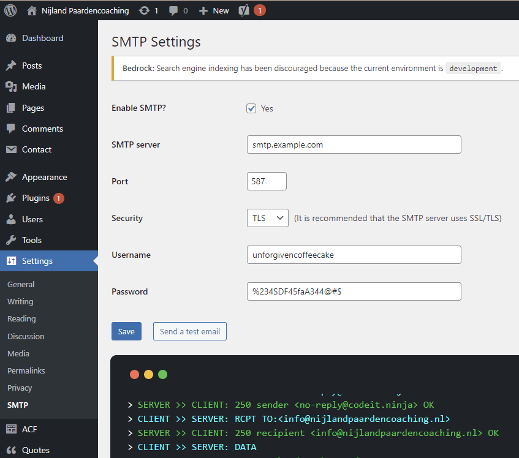

# WordPress SMTP
&nbsp;
<p align="center" style="margin: 1rem 0;">
    
</p>
&nbsp;

A bloatware free SMTP plugin for WordPress. This plugin does not bother you to upgrade to a paid version like most of the other plugins do, or add unnecessary styling / scripting.

This is just a plain plugin which tells WordPress to use *PHPMailer* and *SMTP* with the provided settings.

## Installation

Download the latest release, or when using composer use

```bash
composer require codeit/codeit-ninja/wordpress-smtp
```

## Usage

Activate the plugin and go to `Settings -> SMTP`, provide the necessary detail. Before you enable it make sure you first send a test email. If the test failed, make sure to resolve the problem first before enabling!

<p align="left">
    
</p>

If you enable with a faulty config, none of your contact forms will work any longer.

If nothing wen't wrong and you successfully recieved the test email in your inbox you can check the 'Enable SMTP' checkbox.

## Bugs / issues

Did you ran into a problem thats the fault of this package? Don't hesitate to submit a new issue.